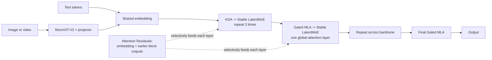

# Kimi K3 Linear Attention

## Intuition, architecture, and a concrete KDA walkthrough

Source: [`k3_tech_report.pdf`](./k3_tech_report.pdf), especially sections 2.1,
5.1, and 5.4.

The shortest useful description is:

> Full attention keeps every previous token and searches them again. Kimi Delta
> Attention maintains a fixed-size learned whiteboard, edits it after every
> token, and reads from that whiteboard.

For fixed model dimensions, KDA's total work grows linearly with sequence length
while its recurrent-state memory stays fixed. The tradeoff is that the
whiteboard is a compressed summary: old details can fade, collide, or be
overwritten.

Kimi K3 therefore does not replace every global-attention layer with KDA. It
uses a hybrid architecture: three KDA layers followed by one Gated MLA layer,
repeated throughout the backbone.

---

# 1. Where linear attention fits in Kimi K3



The architecture mixes information in three directions.

## Across tokens

Each repeated block contains:

```text
KDA -> Stable LatentMoE
KDA -> Stable LatentMoE
KDA -> Stable LatentMoE
Gated MLA -> Stable LatentMoE
```

KDA provides inexpensive, recency-aware sequence mixing. Gated MLA periodically
restores unrestricted token-to-token interaction. K3 also places an additional
Gated MLA layer at the end of the backbone.

## Across channels

Stable LatentMoE performs sparse channel mixing. For each token, K3 activates 16
of 896 routed experts, in addition to shared experts. The routed experts operate
in a smaller latent space to control communication and weight traffic.

## Across depth

Ordinary residual connections force every layer to inherit one accumulated
representation from the layer immediately before it.

Attention Residuals instead let a layer learn a weighted mixture of the
embedding and earlier block outputs. This is attention over network depth rather
than over token positions.

---

# 2. Full attention versus KDA

Suppose the model has already read \(n\) tokens.

## Full softmax attention

Full attention retains a key and value for every previous token:

```text
token 1 -> key 1, value 1
token 2 -> key 2, value 2
...
token n -> key n, value n
```

A new query compares itself with all \(n\) keys and uses the resulting weights
to combine all \(n\) values.

This gives precise access to individual tokens, but:

- full-sequence attention performs roughly \(O(n^2)\) token-pair comparisons;
- the decoding KV cache grows with \(n\);
- each new decoding step reads a growing history.

## Kimi Delta Attention

KDA carries one fixed-size matrix \(S\) per attention head:

```text
old state + current token -> new state
new state + current query -> attention output
```

For fixed head dimensions, every token performs a fixed-size state update and
read. The total recurrence therefore grows roughly linearly with the number of
tokens, while the state size does not grow with the sequence.

The state behaves like an associative memory:

- the key \(k\) identifies where to write;
- the value \(v\) says what to write;
- the retention vector \(\alpha\) fades old channels;
- the write strength \(\beta\) controls how strongly to correct them;
- the query \(q\) identifies what to read.

---

# 3. The KDA recurrence

For one attention head, the report defines:

$$
S_t =
\left(I - \beta_t k_t k_t^\top\right)
\operatorname{Diag}(\alpha_t)S_{t-1}
+ \beta_t k_t v_t^\top
$$

and:

$$
\widetilde{o}_t = S_t^\top q_t
$$

It is useful to split it into four named pieces:

$$
D_t = \operatorname{Diag}(\alpha_t)S_{t-1}
$$

$$
E_t = I - \beta_t k_t k_t^\top
$$

$$
R_t = E_tD_t
$$

$$
W_t = \beta_t k_t v_t^\top
$$

Then:

$$
S_t = R_t + W_t,
\qquad
\widetilde{o}_t = S_t^\top q_t
$$

In words:

```text
fade old memory
-> erase the conflicting fraction at address k
-> write value v at address k
-> query the resulting state with q
```

The delta erase is the important part. A purely additive linear-attention state
would keep accumulating writes. KDA can correct an existing association before
writing the new value.

---

# 4. Concrete toy example

This example begins at the attention boundary. The real model's learned
projection stack has already produced \(q\), \(k\), \(v\), \(\alpha\), and
\(\beta\).

We use one attention head with:

- two key dimensions representing the addresses `Alice` and `Bob`;
- two value dimensions representing `tea` and `coffee`.

The recurrent state is:

$$
S =
\begin{bmatrix}
\text{Alice -> tea} & \text{Alice -> coffee}\\
\text{Bob -> tea} & \text{Bob -> coffee}
\end{bmatrix}
$$

The one-hot vectors are already L2-normalized, as KDA requires for queries and
keys.

## Attention inputs

| Input                  |     \(q\) |     \(k\) |     \(v\) |    \(\alpha\) | \(\beta\) |
| ---------------------- | --------: | --------: | --------: | ------------: | --------: |
| Alice likes tea        | \([1,0]\) | \([1,0]\) | \([1,0]\) | \([0.9,0.9]\) |   \(0.8\) |
| Bob likes coffee       | \([0,1]\) | \([0,1]\) | \([0,1]\) | \([0.9,0.9]\) |   \(0.8\) |
| Alice now likes coffee | \([1,0]\) | \([1,0]\) | \([0,1]\) | \([0.8,0.9]\) |  \(0.75\) |

Interpretation:

```text
k = [1, 0]  -> write at Alice's address
k = [0, 1]  -> write at Bob's address

v = [1, 0]  -> write tea
v = [0, 1]  -> write coffee

q = [1, 0]  -> read Alice's address
q = [0, 1]  -> read Bob's address
```

Start with empty memory:

$$
S_0 =
\begin{bmatrix}
0 & 0\\
0 & 0
\end{bmatrix}
$$

---

# 5. Token 1: Alice likes tea

The projected inputs are:

$$
q_1 = k_1 =
\begin{bmatrix}1\\0\end{bmatrix},
\qquad
v_1 =
\begin{bmatrix}1\\0\end{bmatrix},
\qquad
\alpha_1 =
\begin{bmatrix}0.9\\0.9\end{bmatrix},
\qquad
\beta_1 = 0.8
$$

## Decay

The state is empty, so decay still produces zero:

$$
D_1 =
\begin{bmatrix}
0.9 & 0\\
0 & 0.9
\end{bmatrix}
S_0
=
\begin{bmatrix}
0 & 0\\
0 & 0
\end{bmatrix}
$$

## Select Alice's address

$$
k_1k_1^\top =
\begin{bmatrix}1\\0\end{bmatrix}
\begin{bmatrix}1&0\end{bmatrix}
=
\begin{bmatrix}
1&0\\
0&0
\end{bmatrix}
$$

The erase matrix is:

$$
E_1 =
I - 0.8k_1k_1^\top
=
\begin{bmatrix}
0.2&0\\
0&1
\end{bmatrix}
$$

There is nothing to erase:

$$
R_1 = E_1D_1 =
\begin{bmatrix}
0&0\\
0&0
\end{bmatrix}
$$

## Write tea at Alice's address

$$
W_1 =
0.8k_1v_1^\top
=
0.8
\begin{bmatrix}1\\0\end{bmatrix}
\begin{bmatrix}1&0\end{bmatrix}
=
\begin{bmatrix}
0.8&0\\
0&0
\end{bmatrix}
$$

The new state is:

$$
S_1 = R_1 + W_1 =
\begin{bmatrix}
0.8&0\\
0&0
\end{bmatrix}
$$

## Read the output

$$
\widetilde{o}_1 =
S_1^\top q_1
=
\begin{bmatrix}
0.8&0\\
0&0
\end{bmatrix}
\begin{bmatrix}1\\0\end{bmatrix}
=
\begin{bmatrix}
0.8\\
0
\end{bmatrix}
$$

The head returns a tea score of \(0.8\) and a coffee score of \(0\).

---

# 6. Token 2: Bob likes coffee

The projected inputs are:

$$
q_2 = k_2 =
\begin{bmatrix}0\\1\end{bmatrix},
\qquad
v_2 =
\begin{bmatrix}0\\1\end{bmatrix},
\qquad
\alpha_2 =
\begin{bmatrix}0.9\\0.9\end{bmatrix},
\qquad
\beta_2 = 0.8
$$

## Decay

$$
D_2 =
\begin{bmatrix}
0.9&0\\
0&0.9
\end{bmatrix}
\begin{bmatrix}
0.8&0\\
0&0
\end{bmatrix}
=
\begin{bmatrix}
0.72&0\\
0&0
\end{bmatrix}
$$

## Select Bob's address

$$
E_2 =
I - 0.8k_2k_2^\top
=
\begin{bmatrix}
1&0\\
0&0.2
\end{bmatrix}
$$

Alice's row is not targeted:

$$
R_2 = E_2D_2 =
\begin{bmatrix}
0.72&0\\
0&0
\end{bmatrix}
$$

## Write coffee at Bob's address

$$
W_2 =
0.8
\begin{bmatrix}0\\1\end{bmatrix}
\begin{bmatrix}0&1\end{bmatrix}
=
\begin{bmatrix}
0&0\\
0&0.8
\end{bmatrix}
$$

The new state is:

$$
S_2 =
\begin{bmatrix}
0.72&0\\
0&0.8
\end{bmatrix}
$$

It now contains two associations:

```text
Alice -> tea:    0.72
Bob   -> coffee: 0.80
```

The output for Bob's query is:

$$
\widetilde{o}_2 =
S_2^\top q_2
=
\begin{bmatrix}
0\\
0.8
\end{bmatrix}
$$

---

# 7. Token 3: Alice now likes coffee

This token conflicts with the earlier Alice-to-tea association.

The projected inputs are:

$$
q_3 = k_3 =
\begin{bmatrix}1\\0\end{bmatrix},
\qquad
v_3 =
\begin{bmatrix}0\\1\end{bmatrix},
\qquad
\alpha_3 =
\begin{bmatrix}0.8\\0.9\end{bmatrix},
\qquad
\beta_3 = 0.75
$$

## Step 1: decay the old memory

$$
D_3 =
\begin{bmatrix}
0.8&0\\
0&0.9
\end{bmatrix}
\begin{bmatrix}
0.72&0\\
0&0.8
\end{bmatrix}
=
\begin{bmatrix}
0.576&0\\
0&0.72
\end{bmatrix}
$$

## Step 2: construct Alice's erase matrix

$$
k_3k_3^\top =
\begin{bmatrix}
1&0\\
0&0
\end{bmatrix}
$$

$$
E_3 =
I - 0.75k_3k_3^\top
=
\begin{bmatrix}
0.25&0\\
0&1
\end{bmatrix}
$$

The selected Alice row retains only \(25\%\) of its decayed value.

## Step 3: apply the erase

$$
R_3 =
E_3D_3
=
\begin{bmatrix}
0.25&0\\
0&1
\end{bmatrix}
\begin{bmatrix}
0.576&0\\
0&0.72
\end{bmatrix}
=
\begin{bmatrix}
0.144&0\\
0&0.72
\end{bmatrix}
$$

Alice's tea association has fallen from \(0.72\) to \(0.144\).

## Step 4: write Alice to coffee

$$
W_3 =
0.75
\begin{bmatrix}1\\0\end{bmatrix}
\begin{bmatrix}0&1\end{bmatrix}
=
\begin{bmatrix}
0&0.75\\
0&0
\end{bmatrix}
$$

## Step 5: produce the new state

$$
S_3 =
R_3 + W_3
=
\begin{bmatrix}
0.144&0.75\\
0&0.72
\end{bmatrix}
$$

The state now reads:

| Address |       Tea |   Coffee |
| ------- | --------: | -------: |
| Alice   | \(0.144\) | \(0.75\) |
| Bob     |     \(0\) | \(0.72\) |

## Step 6: read Alice's address

$$
\widetilde{o}_3 =
S_3^\top q_3
=
\begin{bmatrix}
0.144&0\\
0.75&0.72
\end{bmatrix}
\begin{bmatrix}1\\0\end{bmatrix}
=
\begin{bmatrix}
0.144\\
0.75
\end{bmatrix}
$$

The concrete attention-head output is:

```text
tea score:    0.144
coffee score: 0.750
```

Coffee wins.

This is the central KDA behavior:

```text
the key selected Alice's memory
-> alpha faded the old state
-> beta erased most of the conflicting tea association
-> the delta write installed coffee
-> the query read the corrected Alice row
```

---

# 8. What the real KDA layer adds

The toy example isolates the recurrence. The actual K3 layer also includes:

1. **Learned projections.** The hidden token representation is transformed into
   \(q\), \(k\), \(v\), \(\alpha\), and \(\beta\).
2. **Short convolution and Swish.** Query, key, and value projections receive
   local sequence processing before the recurrence.
3. **L2 normalization.** Queries and keys are normalized.
4. **Channel-wise retention.** Each key channel gets its own \(\alpha\), allowing
   different kinds of information to decay at different rates.
5. **Head-wise RMSNorm and an output gate.** The recurrent output is normalized
   and filtered by an input-dependent full-rank gate.
6. **Multiple heads.** Different heads maintain different learned associative
   memories.

The output of one KDA head is not a final token probability. It is normalized,
gated, projected, combined with other heads and residual paths, processed by
later layers, and eventually mapped to vocabulary logits.

---

# 9. Why the decay is lower-bounded

K3 derives retention through:

$$
g_t = g_{\min}\operatorname{Sigmoid}(e^A z_t),
\qquad
\alpha_t = \exp(g_t),
\qquad
g_{\min}=-5
$$

Therefore:

$$
e^{-5} < \alpha_{t,j} < 1
$$

The reason is mainly numerical and architectural.

During chunkwise training, cumulative retention is a product of many
\(\alpha\) values. If retention can approach zero without a lower bound, the
reciprocal rescaling used by the parallel formulation can overflow in BF16.

Bounding the decay keeps the relevant values inside BF16's dynamic range over a
16-token tile. K3 can then evaluate every causal tile with dense Tensor Core
matrix multiplications instead of using a slower special path for diagonal
tiles.

---

# 10. How KDA is parallelized

The token-by-token recurrence is naturally serial:

```text
S0 -> token 1 -> S1 -> token 2 -> S2 -> token 3 -> S3
```

GPUs prefer large parallel matrix operations, so K3 uses a chunkwise form:

```text
chunk 1 -> state -> chunk 2 -> state -> chunk 3
```

- State propagation remains recurrent across chunks.
- Token interactions are computed in parallel within each chunk.
- FlashKDA overlaps intra-chunk work with cross-chunk state propagation.
- KDA Context Parallelism represents each segment as a state transition plus a
  locally generated state, then composes segment transitions with a prefix scan.

This systems work is necessary: the fixed-size state solves the growing-cache
problem, but introduces a serial dependency that must be reorganized for GPU
execution.

---

# 11. Why K3 keeps global MLA layers

A fixed-size associative memory is necessarily lossy. As a context grows:

- unrelated information may map to overlapping keys;
- weak associations may decay;
- later updates may overwrite earlier details;
- a summary may preserve meaning without preserving an exact token.

Gated MLA layers provide periodic unrestricted global attention, allowing tokens
to interact directly rather than exclusively through the compressed KDA state.

The hybrid pattern is therefore a deliberate compromise:

| Mechanism | Main strength                                           | Main cost                                           |
| --------- | ------------------------------------------------------- | --------------------------------------------------- |
| KDA       | Fixed-size recurrent memory and linear sequence scaling | Compression and serial recurrence                   |
| Gated MLA | Direct global token interaction                         | Sequence-growing KV cache and global-attention cost |

K3 spends most of its attention layers on KDA and periodically pays for MLA:

```text
cheap summary
cheap summary
cheap summary
global lookup
```

---

# 12. Important qualifications

## The entire K3 model does not have constant context memory

KDA state size is independent of sequence length, but the periodic MLA layers
still maintain a KV cache that grows with the context. K3 serving infrastructure
must manage both cache types together.

## Linear does not mean information is preserved perfectly

Linear attention replaces an expanding token archive with a bounded memory.
That is useful precisely because it compresses, but compression has a ceiling.

## The reported 2.5x scaling gain is not a KDA-only result

The report attributes its overall scaling-efficiency improvement to the combined
K3 recipe: KDA, Attention Residuals, Stable LatentMoE, architecture changes,
data, and training changes. It should not be interpreted as a clean measurement
of linear attention alone.

---

# 13. Mental model to keep

Use this picture:

```text
Full attention:
    keep every note card
    -> search every card when answering

KDA:
    maintain a learned whiteboard
    -> fade stale sections
    -> erase conflicting entries
    -> write corrections
    -> read the relevant section

K3:
    use the whiteboard for most layers
    -> periodically reopen the complete note-card archive with MLA
```

The architecture is not choosing between perfect retrieval and efficient
memory. It combines them at different frequencies.
